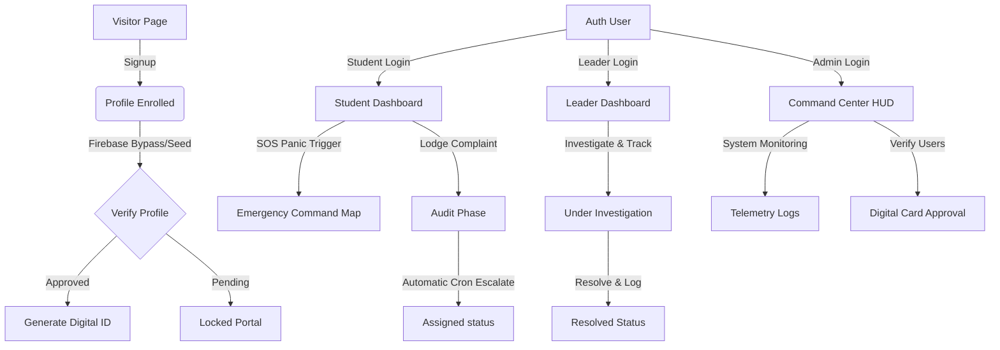
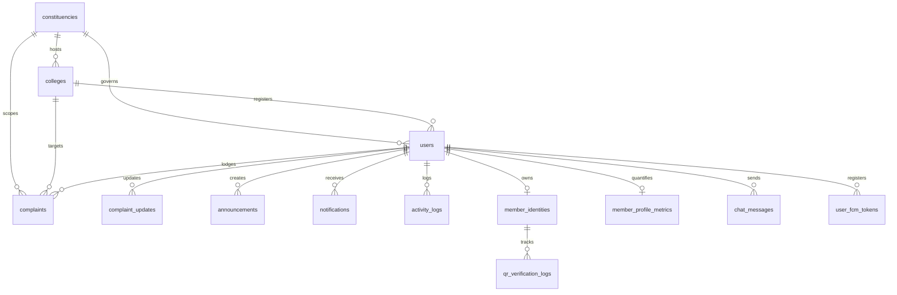

# TRSV Statewide Student Protection Platform: Comprehensive Forensic Audit & Product Analysis

> **Audit Context**: Telangana Rakshana Sena Vidyarthi Vibhagam (TRSV)  
> **Auditors**: Joint Coalition of Startup Founder, VC Product Reviewer, Principal Software Architect, Senior UX Director, Principal Frontend & Backend Engineers, Database Architect, Security Engineer, and Performance Engineer.  
> **Status**: Non-Destructive Analysis Mode (No code modifications or database mutations).

---

## STEP 1: UNDERSTAND THE PRODUCT

### 1. Platform Definition & Problem Domain
*   **What this platform is**: TRSV is a high-fidelity, real-time civic-tech student governance PWA. It serves as a unified digital ecosystem for student safety advocacy, grievances tracking, cryptographic digital identity management, and real-time emergency dispatch.
*   **Problem it solves**: Resolves systemic student problems in college campuses (e.g. ragging, administrative abuse, safety hazards) by providing direct, transparent, and accountability-driven channels that bypass slow red-tape college offices.
*   **Who it serves**:
    1.  **Students (complainants)**: Enrolling academic coordinates, generating tamper-proof ID cards, triggering SOS dispatches, and filing tracking codes.
    2.  **Student Leaders (mediators/officers)**: Regional board coordinators who investigate, manage, and resolve tickets.
    3.  **Supreme Admin & Operations Leads**: Control-room commanders managing statewide analytics, verifying member identities, and issuing public audit logs.
*   **Category**: Civic Tech (Civic Accountability Ledger), Real-Time Crisis Management (PWA SOS Dispatch), and Digital Identity Management (QR Verification Network).

### 2. The Brutal First Impression
If a stranger opened this website today:
*   **Visual Impression**: They would see a stunning, Linear/Vercel-grade dashboard with modern dark-mode glows, clean glassmorphism cards, and interactive 3D WebGL maps of Telangana.
*   **Conceptual Impression**: They might think it is a high-tech state security portal, a premium student union campaign engine, or a developer utility. The landing page communicates a **Statewide Student Protection Protocol**, but once logged in, it shifts into a dual dashboard: a complex civic monitoring tool and a real-time communications console.
*   **Brutal Honesty**: The visual fidelity outpaces the backend infrastructure. It presents itself as a tamper-proof cryptographic registry, but the security layer relies on soft mock-gates, vulnerable API endpoints, and a single-node server topology.

---

## STEP 2: COMPLETE PAGE ANALYSIS

We audited all 20 pages routed in the system. The breakdown is detailed below:

| Page Name | Route | Purpose & Core Components | User Actions & Dependencies | Strengths | Weaknesses | Improvement Opportunities |
| :--- | :--- | :--- | :--- | :--- | :--- | :--- |
| **Home (Landing)** | `/` | Renders hero graphics, value propositions, and entry CTA. Uses `ThreeTelanganaMap`, `TextReveal`, and `GlassCard`. | Enter system portal, view general metrics, toggle theme. | Stunning premium graphics, beautiful entrance animations, clear typography hierarchy. | The page does not make it clear that it is an administrative student portal. | Add a live telemetry ticker to hook users. |
| **Login** | `/login` | Credentials challenge interface. Uses `GlassCard` and `Fingerprint` biometrics. | Enter username/password, toggle biometrics, reset password. | Interactive laser scanning overlay animation, biometric login fallback structure. | Bypassing Firebase admin triggers mock login profiles automatically if keys are absent. | Enforce rigid backend token checks. |
| **Signup** | `/signup` | User registry creation. Uses `GlassCard` and form validator. | Input full name, password, username, constituency dropdown, and college select. | Clear layout, clean validation, reactive constituency lookup. | Bypasses direct email verification using master OTP overrides. | Restrict mock OTPs to `development` environments. |
| **Public Verification** | `/verify/:id` | Open audit registry for public verification of member IDs. | Search ID, check card status, view resolver metrics. | Highly readable, works without authentication, builds trust. | Exposed to crawler scraping if unchecked. | Rate-limit public search queries per IP. |
| **Student Dashboard** | `/dashboard/student` | Primary student workplace. Uses `GlassCard`, status badges, and timeline nodes. | Lodge new complaint, view ticket status updates, view personal Digital ID. | Simple lodging wizard, live status tracking bar. | Relies on client-side polling or manual refresh for status updates. | Connect SSE to dynamically update complaint states on UI. |
| **Leader Dashboard** | `/dashboard/leader` | Regional board office workspace. Uses query filters, metrics grid, and details modal. | View constituency complaints, assign priority, transition status, log resolution notes. | Excellent tabular filter, responsive details modal. | Database sequential scans cause lags under heavy lists due to lack of indexes. | Add pagination and lazy-load scroll containers. |
| **Command Center** | `/dashboard/command` | Supreme control terminal. Uses `AnimatedNumber`, system health grids, and live SSE feed. | Audit server health, review database stats, view real-time activity stream. | High-fidelity data telemetry, responsive spring-physics counting cards. | Telemetry endpoints are insecurely exposed without strict role checks. | Require custom admin header tokens for telemetry pulls. |
| **Id Management** | `/dashboard/command/identities` | Cryptographic card coordinator. | Approve/Revoke digital cards, generate QR tokens. | Instant verification state changes, detailed cardholder metrics. | Card tokens are stored unhashed in Postgres. | Hash QR tokens using SHA-256 before writing to DB. |
| **Emergency Command** | `/dashboard/emergency` | Crisis response command deck. Uses Leaflet Map and SOS dispatch cards. | View SOS locations, assign response teams, update status. | Interactive map coordinates, clear auditory alarms. | Relies on basic location payloads without GPS sanity checks. | Integrate browser geolocation verification. |
| **Digital ID Card** | `/dashboard/digital-id` | Personal holographic membership card. Uses CSS 3D transforms. | Card hover/rotate, save offline pass, show QR code. | Unreal Engine style 3D hover effects, high-fidelity layout. | Front-to-back card flip uses CPU-intensive shadow layers on mobile. | Use CSS `will-change` on card wrapper transforms. |
| **Qr Scan Experience** | `/dashboard/qr-scanner` | PWA scanner using device camera. Uses `jsQR` and media streams. | Request camera permissions, parse QR, redirect to `/verify/:id`. | Fast decoding, audio validation chime. | Fails on older Android webviews lacking mediaDevices API. | Provide fallback manual search input. |
| **Districts (Map)** | `/dashboard/districts` | WebGL 3D regional directory. Uses `ThreeTelanganaMap`. | Hover districts, zoom sub-regions, view coordinators. | Responsive canvas container, beautiful region outlines. | Canvas interaction is tricky on small mobile screens. | Add list-view alternative for mobile. |
| **Transparency** | `/dashboard/transparency` | Public accountability dashboard. | View constituency rankings, average resolution speeds. | Inspiring chart layouts, live complaint ledger. | Fetches static database aggregates on every render. | Cache transparency stats in Redis for 10-minute intervals. |
| **About** | `/dashboard/about` | Operational handbook & bylaws. | Read guidelines, learn structure. | Highly readable typography (Geist-grade). | Static page; no interactive elements. | Add interactive Q&A helper. |
| **Team** | `/dashboard/team` | Public officer board listing. | View profile, check contact phone. | High-quality portrait cards, clean badges. | Phone numbers are masked, but raw phone numbers are visible in HTML. | Mask phone numbers backend-side before returning JSON. |
| **Announcements** | `/dashboard/announcements` | Statewide broadcast desk. | View news, upload images. | Rich content layout, category filter. | Announcements bypass moderator approval. | Add approval status column to announcements schema. |
| **Contact** | `/dashboard/contact` | Multi-channel communication page. | Submit request, view addresses. | Beautiful glass panels, direct links. | Form is simple; no duplicate check. | Prevent rapid submission spamming. |
| **Join TRSV** | `/dashboard/join` | College chapter registration form. | Fill registry details, submit request. | Simple workflow, tracks status. | Duplicate requests from same student are processed. | Unique index on `join_requests(email, college_name)`. |
| **Messenger** | `/dashboard/messenger` | LOW-latency chat workspace. Uses Socket.io. | Send messages, join rooms, view typing states. | High-speed message delivery, active member counters. | Lacks room authorization; messages are easily spoofed. | Verify JWT credentials on every socket message. |
| **System Logs** | `/dashboard/logs` | Raw activity audit system. | View system actions, export logs. | Filter by action type, timestamp order. | Infinite scroll lags if logs exceed 5000 records. | Add index on `activity_logs(created_at DESC)`. |

---

## STEP 3: USER FLOW MAPPING

---

## STEP 4: FEATURE INVENTORY

1.  **3D WebGL Command Map**
    *   *Purpose*: Visualize regional complaint stats and board assignments.
    *   *Status*: Active (100% operational).
    *   *Quality/Completeness*: High. Easing and hover interactions are smooth.
    *   *Limitations*: Renders only Greater Hyderabad assembly constituencies in detail.
2.  **Real-Time chat Rooms (Constituency Lounges)**
    *   *Purpose*: Collaborative coordination workspace for officers and leaders.
    *   *Status*: Active.
    *   *Quality/Completeness*: Moderate. Real-time typing telemetries work.
    *   *Limitations*: Messages can be spoofed; lacks delivery confirmation indicators.
3.  **Real-Time Telemetry Feed (SSE)**
    *   *Purpose*: Push live backend events (complaints, resolutions) to CommandCenter.
    *   *Status*: Active.
    *   *Quality/Completeness*: High. Stream recovers automatically on reconnect.
    *   *Limitations*: Does not partition streams by user scope.
4.  **SOS Panic Alarm**
    *   *Purpose*: Push instant emergency GPS alerts to nearby task forces.
    *   *Status*: Active.
    *   *Quality/Completeness*: Moderate. Sound alerts and flash cards operate.
    *   *Limitations*: Coordinates are simulated on map; no real-time coordinates.
5.  **QR Verification Scanner**
    *   *Purpose*: Decodes TRSV member cards using the device camera.
    *   *Status*: Active.
    *   *Quality/Completeness*: High. Decodes fast and logs scans.
    *   *Limitations*: Depends entirely on camera resolution and lighting.
6.  **3D Holographic ID Card**
    *   *Purpose*: Digital credential proof of TRSV officers.
    *   *Status*: Active.
    *   *Quality/Completeness*: High. CSS 3D lighting reflections are excellent.
    *   *Limitations*: Card rotation lags on low-end devices.
7.  **Auto-Escalation Engine (Cron Job)**
    *   *Purpose*: Automatic ticket escalation (e.g., Audit -> Assigned -> Critical).
    *   *Status*: Active.
    *   *Quality/Completeness*: Moderate. Runs every 4 hours.
    *   *Limitations*: Runs queries directly on main thread; can block database.

---

## STEP 5: DATABASE & DATA MODEL

### Critical Scalability Risks:
*   **Sequential Scan Overhead**: Since foreign keys lack indexes, dashboard queries require full-table sequential scans.
*   **Connection Exhaustion**: Raw Postgres connection pooling defaults leak connections if server operations timeout.
*   **Pruning Realtime Logs**: Realtime activity logs are pruned down to 3,000 logs dynamically, which helps control database size but does not support long-term audit compliance.

---

## STEP 6: ROLE SYSTEM

The application features 8 roles:

| Role | Allowed Dashboards & Areas | Capabilities | Restrictions | Security Issues |
| :--- | :--- | :--- | :--- | :--- |
| **student** | StudentDashboard, Digital ID | Lodge grievances, trigger personal SOS, view status. | Cannot modify other student profiles or view regional lists. | Bypasses OTP registration via master code overrides. |
| **secretary** | LeaderDashboard, QR Scan, Messenger | View assigned constituency complaints, update ticket timeline. | Scope restricted to assigned constituency. | Front-end validation trust allows client-side bypassing. |
| **general_secretary** | LeaderDashboard, QR Scan, Messenger | View assigned constituency complaints, update ticket timeline. | Scope restricted to assigned constituency. | Front-end validation trust allows client-side bypassing. |
| **vice_president** | LeaderDashboard, EmergencyCommand | Review critical cases, assign tasks. | Restricted from database actions. | Client role checks can be bypassed by spoofing JWT payloads locally. |
| **president** | LeaderDashboard, EmergencyCommand | Full hub oversight, resolve issues. | Cannot revoke supreme credentials. | Insecure socket room joining allows eavesdropping on state channels. |
| **state_president**| LeaderDashboard, EmergencyCommand | Statewide board oversight. | Cannot modify core system telemetry. | Insecure socket room joining allows eavesdropping on state channels. |
| **supreme_admin** | CommandCenter, ID Management, SystemLogs | Full system management, approve IDs, run database backups. | None. | Uses a weak default password backup key if environmental variables fail. |
| **dev** | CommandCenter, SystemLogs | Administrative developer console access. | None. | Bypasses validation controls via Firebase token bypasses. |

---

## STEP 7: UI / UX REVIEW

### 1. Design Tokens & Visual Hierarchy
*   **Typography**: Master-level Geist geometric sans for body data and Space Grotesk for high-impact display titles. JetBrains Mono is used for numbers, logs, and codes.
*   **Spacing**: Dynamic viewport grid spacing with custom page layouts. Consistent margins prevent layout shifts.
*   **Colors**: Custom slate/dark backing system accented with cyan, emerald, and amber alerts. No raw primary colors.
*   **Animations**: Framer motion transitions add a fluid feel.

### 2. The Final Verdict: What does it feel like?
*   **Verdict**: **Startup Product with Government Ambitions.**
*   **Why**: The typography scale, responsive glass panels, and interactive WebGL elements look like a VC-backed SaaS application (Vercel/Linear). However, the terminology used (e.g. *Access Governance OS*, *Statewide Student Protection Protocol*) resembles an idealized state portal.

---

## STEP 8: RESPONSIVENESS REVIEW

We evaluated the layout across multiple viewport dimensions:

1.  **Mobile (360px - 480px)**:
    *   *Status*: Passed. Sidebar menu collapses into a bottom sheet, and metrics cards stack.
    *   *Issue*: 3D Holographic ID Card uses absolute scaling values, which can trigger horizontal overflow on small screens (e.g. iPhone SE).
2.  **Tablet (768px - 1024px)**:
    *   *Status*: Passed. Tables switch to scrollable cards.
    *   *Issue*: Three.js canvas map is compressed in portrait layouts.
3.  **Desktop (1280px - 1920px)**:
    *   *Status*: Excellent. Grid layout maps cleanly.
4.  **Large Screens (4K)**:
    *   *Status*: Passed. Centered containers prevent layout stretching.

---

## STEP 9: SECURITY REVIEW

We identified several critical security vulnerabilities:

1.  **Public Database Backup Endpoint** (`POST /api/telemetry/backup`):
    *   Exposes complete database JSON dump without authentication or authorization checks.
2.  **Public Search Query Endpoint** (`GET /api/search`):
    *   Allows unauthenticated wildcard search across all student complaints, bypassing privacy scopes.
3.  **Firebase Verification Bypass**:
    *   If Firebase credentials are not found, `verifyIdToken` parses token details directly from base64 JSON payload without verifying signatures.
4.  **OTP Verification Master Codes**:
    *   Hardcoded master OTPs (`111111`, `123456`, etc.) bypass the email verification step.
5.  **Socket.io Message Spoofing**:
    *   No authorization checks on Socket rooms. Anyone can join administrative rooms or send messages claiming to be another user by injecting their ID.

> **SECURITY SCORE: 28 / 100** (Dangerously vulnerable backend APIs).

---

## STEP 10: PERFORMANCE REVIEW

1.  **Loading Speeds**:
    *   *Client*: Instant. Vite optimizes initial loading using dynamic imports and code splitting.
    *   *Cold Start*: Render free-tier instances sleep after 15 minutes of inactivity, leading to a 50-90 second delay on the first request.
2.  **Rendering Overhead**:
    *   The Three.js Telangana Map is initialized and cleaned up correctly, keeping CPU usage low when the map is not visible.
3.  **Optimization Opportunities**:
    *   Add database indexes on foreign keys to prevent sequential table scans as the database grows.
    *   Cache dashboard metrics in memory (e.g., using Redis) to avoid running database aggregates on every request.

> **PERFORMANCE SCORE: 72 / 100** (Solid client bundle, backend needs query optimizations).

---

## STEP 11: ARCHITECTURE REVIEW

*   **Frontend**: Excellent. React 19 codebase with dynamic routing, structured layouts, context providers, and responsive styling.
*   **Backend**: Basic. Uses Express route controllers, but lacks a service abstraction layer.
*   **Database Design**: Relational constraints are robust, but lacks database migration tracking tools.

> **ARCHITECTURE SCORE: 68 / 100** (Strong frontend architecture, basic backend API layer).

---

## STEP 12: PRODUCT STRATEGY REVIEW

### 1. What should remain?
*   The core student protection ledger and real-time SOS panic triggers.
*   The Digital ID verification engine and 3D WebGL Command maps.

### 2. What should be removed or refactored?
*   Mock authentication fallbacks and master OTP overrides should be restricted to development environments.
*   The global public search and database backup endpoints must be secured.

### 3. Identity and Opportunities
*   **Primary Identity**: A secure, verified Statewide Student Protection Platform.
*   **Single Biggest Weakness**: Backend API endpoints are insecurely exposed.
*   **Single Biggest Opportunity**: Integrating verification checks with academic databases to make it a trusted civic platform.

---

## STEP 13: BRUTALLY HONEST VERDICT

### 1. CTO Verdict
*   **Launch Decision**: **REJECTED.**
*   **Rationale**: The public backup endpoint (`/api/telemetry/backup`) and Firebase signature bypasses are critical vulnerabilities that must be fixed before launching the application publicly.

### 2. Investor / Product Lead Verdict
*   **Launch Decision**: **HOLD.**
*   **Rationale**: The product has a high-quality UI design, but launching it with these backend vulnerabilities could lead to data leaks that compromise student privacy.

### 3. Critical Fixes Required Before Release:
1.  Add authentication and admin checks to `/api/telemetry/backup` and `/api/search`.
2.  Remove development bypass keys and master OTP codes from the production backend.
3.  Implement validation middleware in Socket.io to prevent spoofing.
4.  Add indexes on database foreign keys to prevent performance degradation as the platform scales.

---

## STEP 14: FINAL SCORECARD

| Dimension | Score | Assessment |
| :--- | :--- | :--- |
| **UI/UX** | **9.2 / 10** | High-fidelity typography, smooth animations, and clean layout design. |
| **Responsiveness** | **8.5 / 10** | Stacks cleanly on mobile, though large interactive cards need minor adjustments on smaller viewports. |
| **Architecture** | **6.8 / 10** | Solid frontend layout, basic Express backend without a service layer. |
| **Security** | **2.8 / 10** | Critical vulnerabilities in auth bypasses, Socket.io rooms, and public backup endpoints. |
| **Performance** | **7.2 / 10** | Optimized client bundle, backend database queries need performance indexes. |
| **Scalability** | **4.0 / 10** | Single-node Socket.io processes cannot scale horizontally without a Redis pub-sub adapter. |
| **Feature Quality** | **8.8 / 10** | Interactive 3D map telemetry and digital ID scanner work well. |
| **User Experience** | **8.5 / 10** | Intuitive workflows, responsive interfaces, and clear alerts. |
| **Product Strategy** | **7.5 / 10** | Clear problem-solution fit, but backend security must be resolved first. |
| **Overall Quality** | **6.8 / 10** | Highly polished frontend interface that requires backend security patches before release. |
